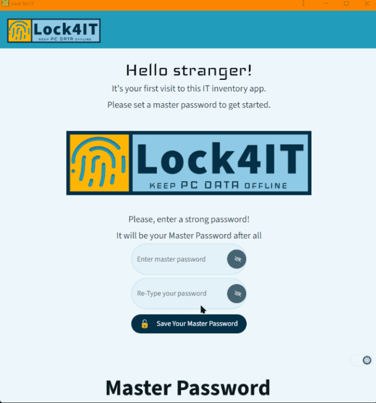
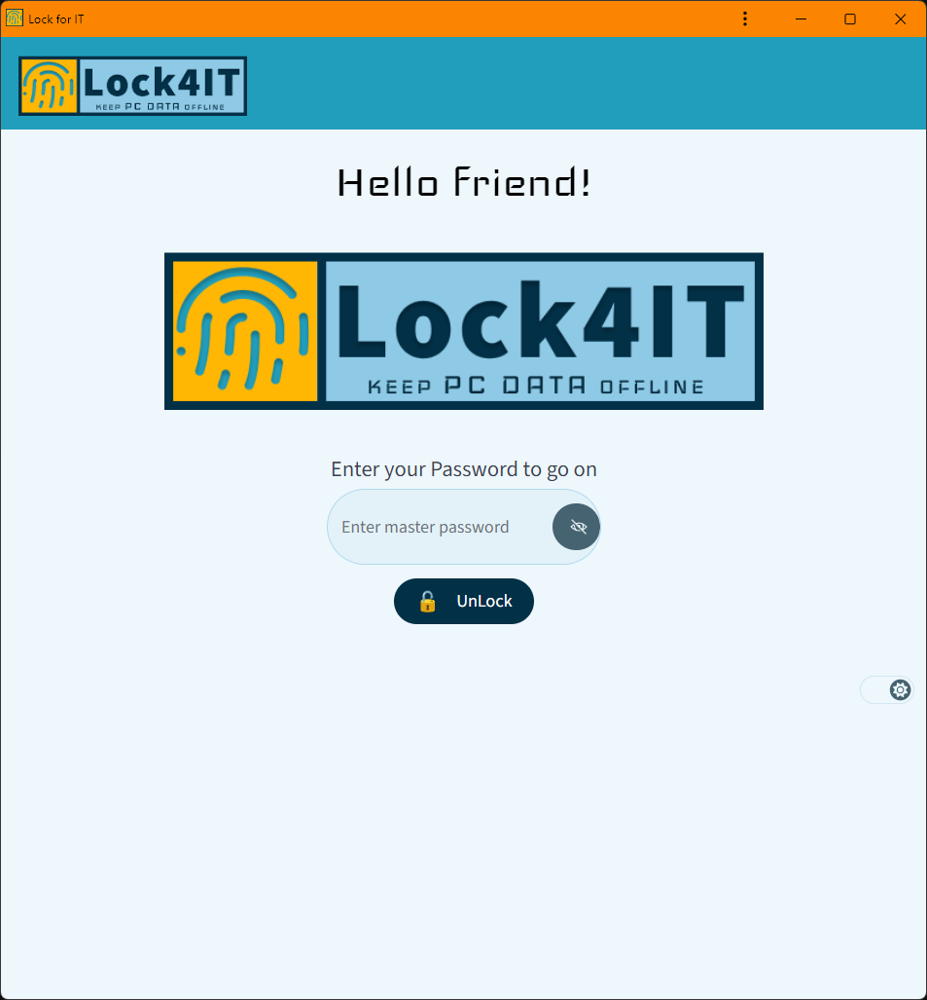
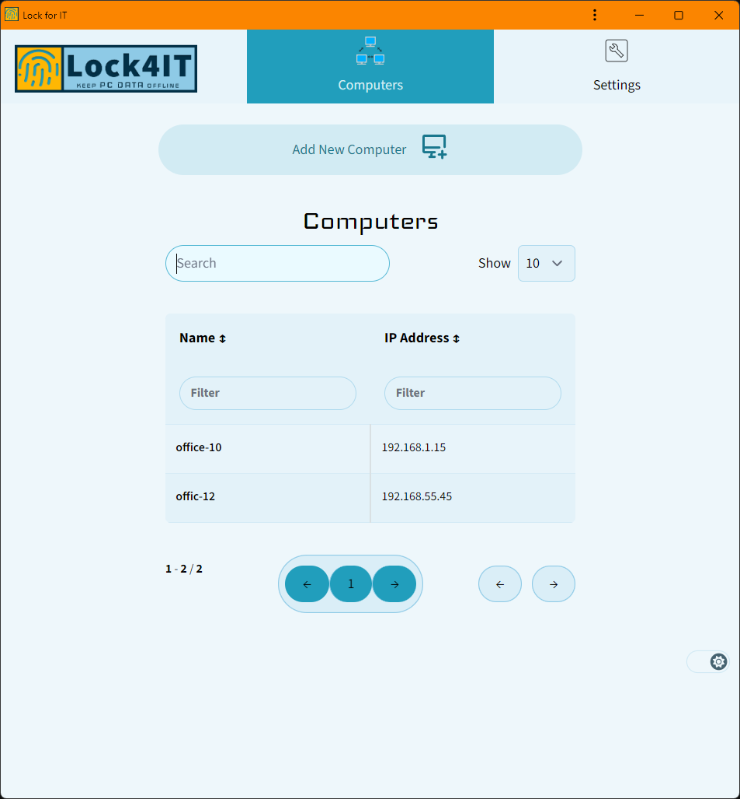
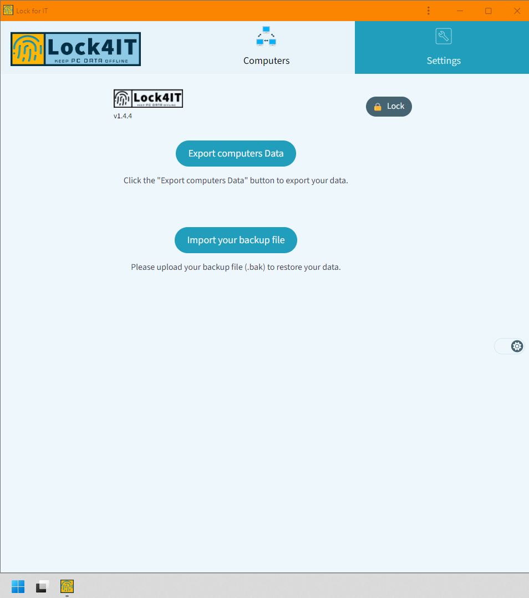

# Lock4IT

## Protected IT Inventory

Offline hardware and software asset management tool for IT professionals.


[](https://opensource.org/licenses/)

## Demo



## Features

- Multi-Lang ! 🇦🇪 - 🇬🇧 - 🇷🇺 - 🇹🇷 - 🇨🇳
- Your data is always stored offline
- Export and back-up encrypted data
- Master Password
- Progressive Web App (PWA)
- Auto Dark Mode

## Run Locally

Can be used in Linux, Windows, macOS and Chromebook PC.

## Develop your own 4IT Inventory

Clone the project

```bash
  degit kaanguru/lock4it/app lock4it
```

or

```bash
git clone https://github.com/kaanguru/lock4it.git --depth 1 --branch main --single-branch
```

Go to the project directory

```bash
  cd lock4it
```

Install dependencies

```bash
  bun install
```

Start the server

```bash
  bun dev
```

## Deployment

To deploy this project run

```bash
  npm run deploy
```

## Documentation

[Documentation](https://www-lock4it.netlify.app/)

## Roadmap

✅ Additional browser support

✅ Add more integrations

✅ Desktop

⌛ Network discovery

## Contributing

We welcome contributions to the project in the form of pull requests or issues. Please read our [contributing guidelines](./contributing.md) for more information.

## Authors

- [@kaanguru](https://github.com/kaanguru/)

## Screenshots





