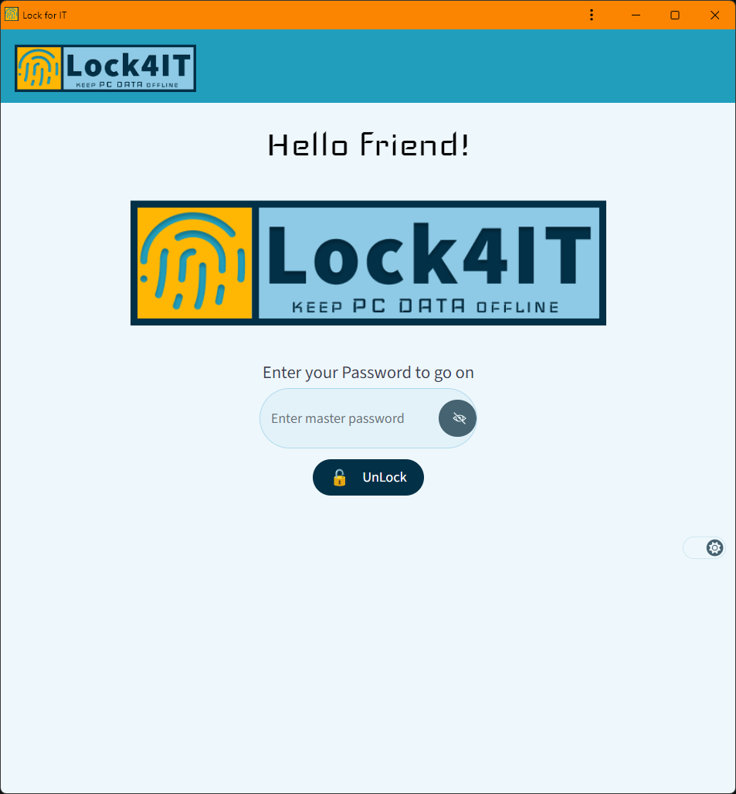

# Code of Conduct

As a contributor, you can help us maintain a positive and inclusive environment in the project. We expect all contributors to follow the code of conduct and to treat each other with respect and professionalism.

**Examples of behavior that contributes to a positive environment for our project include:**

- Using welcoming and inclusive language
- Being respectful of differing viewpoints and experiences
- Gracefully accepting constructive criticism
- Focusing on what is best for the project and its community

**Examples of behavior that is not tolerated include:**

- Using language that is offensive, derogatory, or discriminatory
- Personal attacks or insults
- Public or private harassment
- Publishing other people's private information without their consent

**Reporting Guidelines**

If you believe someone is violating the code of conduct, we encourage you to report it to the project maintainers. You can report it by emailing [insert email address] or by opening an issue on the project's GitHub page.

**Consequences of Violating the Code of Conduct**

If a contributor violates the code of conduct, the project maintainers may take any action they deem appropriate, up to and including removing the contributor from the project.

**Acknowledgments**

This code of conduct is adapted from the Contributor Covenant, version 2.1, available at https://www.contributor-covenant.org/version/2/1/code_of_conduct.html.

**License**

This code of conduct is released under the [GPL-3.0-only](https://opensource.org/license/gpl-3-0) license.

**Contributing**

We welcome contributions to the project in the form of pull requests or issues. Please read our [contributing guidelines](https://github.com/kaanguru/lock4it/blob/main/CONTRIBUTING.md) for more information.

**Authors**

- [@kaanguru](https://github.com/kaanguru/)

**Screenshots**

**Acknowledgments**

This project was created using [SvelteKit](https://kit.svelte.dev/) and [Tailwind CSS](https://tailwindcss.com/).

**Contributing**

We welcome contributions to the project in the form of pull requests or issues. Please read our [contributing guidelines](https://github.com/kaanguru/lock4it/blob/main/contributing.md) for more information.
